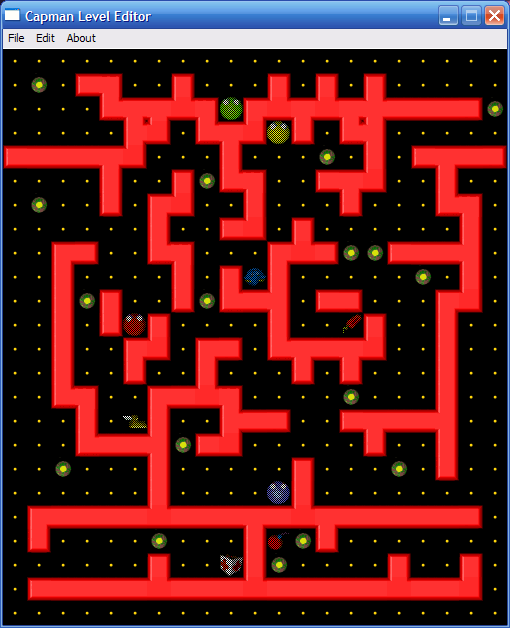

# Capedit2
A better variant of the default [Capman](http://napko.fi/games/capman/) level editor.

### Features
* user-friendly UI,
* labyrinth generator,
* wall shape adjustment,
* setting or clearing a capsule on any level position,
* setting bug count separately for each bug color.

### Tools
* Visual Studio 2008 Express Edition,
* C++,
* WinAPI.

### Known issues
* labyrinth generation could be done better,
* the contact e-mail address shown in the editor is not up-to-date.
